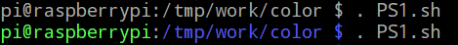
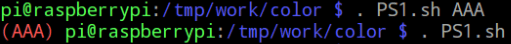
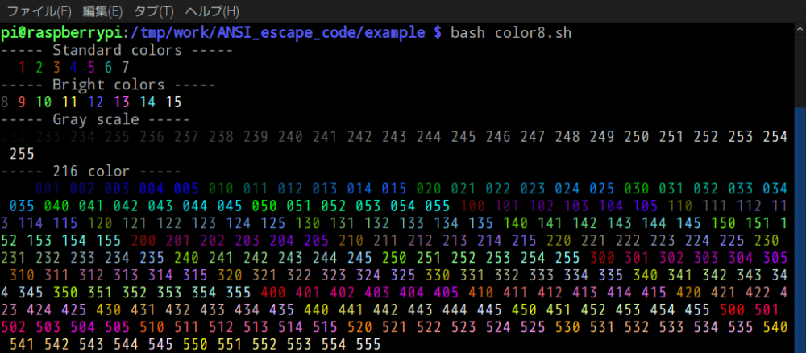
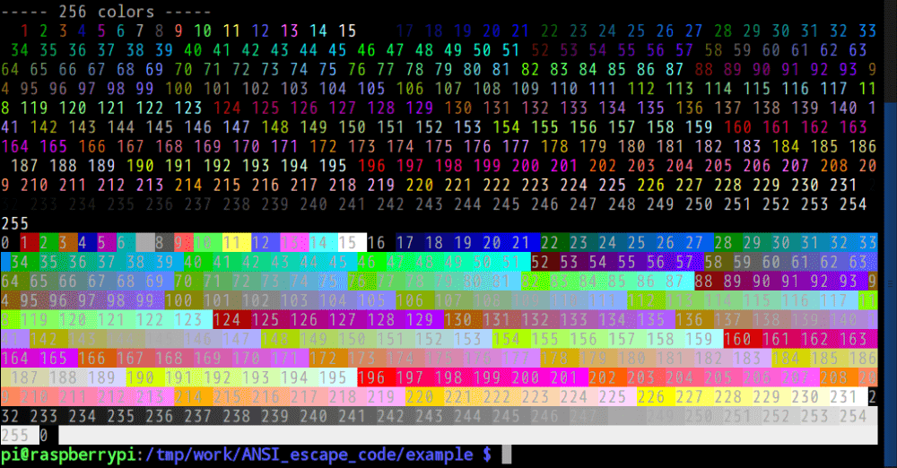

# このソフトウェアについて

シェルで色を変える。PS1, echo。

## PS1




[PS1.sh](src/PS1/PS1.sh)

```sh
$ . PS1.sh
$ source PS1.sh
```

## echo




[コード例集](src/ANSI_escape_code/example)

```sh
$ bash color.sh
$ bash color8.sh
$ bash example.sh
```

# 参考

* https://en.wikipedia.org/wiki/ANSI_escape_code
* https://qiita.com/HMMNRST/items/d8fe7b3c528f447d68a6

# 開発環境

* [Raspberry Pi](https://ja.wikipedia.org/wiki/Raspberry_Pi) 3 Model B
    * [Raspbian](https://www.raspberrypi.org/downloads/raspbian/) GNU/Linux 8.0 (jessie)
        * bash 4.3.30

# ライセンス

このソフトウェアはCC0ライセンスである。

[](http://creativecommons.org/publicdomain/zero/1.0/deed.ja)

# 課題

* テストできなかった
    * [assert.sh](https://github.com/lehmannro/assert.sh)を試すも`\`が消えてしまう
* エラー処理が未実装
    * どうすればいいか
        * 中断する
            * `set -e`, `trap`
        * 継続する
            * 無視する
            * デフォルト値をセットする
            * 上記対応をしてログ出力する
                * 関数の戻り値を`echo`で返しているが、どうする？
    * [color8_define.sh](src/ANSI_escape_code/color8_define.sh)にある`GetColor`関数の引数チェック
        * R,G,Bが0..5の範囲外のときエラーにしたい
            * 現状、範囲外も受け取れるので異常値を返してしまう
    * [SGR_P.sh](src/ANSI_escape_code/SGR_P.sh)の関数も同様
* 相対パスで参照できない
    * 以下の2点を叶えたい
        * プロジェクト内で相対パスを使って分割コードを参照したい
        * 呼出側は任意のカレントディレクトリでOK

